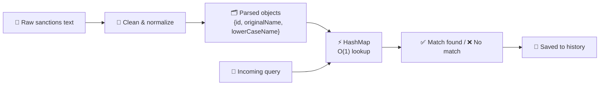

<div align="center" >

# [🚧 CURB](https://shimmiscurb.vercel.app/)

### _Stop blocked transfers before they happen._


</div>

---

## 🔍 What is this?

CURB is a **real-time sanctions screening platform**. It checks individuals and entities against government-issued sanctions lists _before_ a transfer goes through — no waiting, no manual cross-checking spreadsheets, no surprises.

> 💡 **The core idea:** fetch the sanctions data once, hold it in memory, and search it with a hashmap so lookups stay instant even as the list grows into the hundreds (or thousands) of entries.

---

## ✨ Features

|     | Page                  | What it does                                                             |
| --- | --------------------- | ------------------------------------------------------------------------ |
| 🔎  | **Screen Name**       | Check a single name against the live sanctions list in real time         |
| 📦  | **Batch Screen**      | Upload a whole list of names/transfers and screen them all in one go     |
| 📋  | **Sanctions List**    | Browse the full, live-fetched sanctions dataset — searchable & sortable  |
| 🕒  | **Screening History** | Every past session, every query, every result — logged and browsable     |
| 📊  | **Stats Dashboard**   | Live match rate, total sessions, total sanctions loaded, recent activity |

---

## ⚡ Why it's fast

Most naive sanctions checkers loop through the whole list for every single query — that's **O(n × m)**, and it gets slow fast.

CURB does it differently:



1. 🧹 **Clean** — strip out mojibake, smart quotes, and stray parentheses from the raw government dataset
2. 🗂️ **Parse once** — convert the whole list into `{ id, originalName, lowerCaseName }` objects a single time
3. ⚡ **HashMap lookup** — every query becomes an **O(1)** check instead of a full re-scan
4. 💾 **Auto-save** — every session's queries, matches, and stats are written to `localStorage` immediately

Result: a single **O(n)** pass instead of a brute-force **O(n × m)** grind. 🚀

---

## 🧠 Under the hood

- **🌐 Context API** — sanctions data is fetched once at app load and shared everywhere via a single provider, so no page re-fetches or re-parses the same data
- **📡 Axios** — pulls live data straight from the [OpenSanctions](https://www.opensanctions.org/) API (India MHA banned entities dataset)
- **💾 LocalStorage** — every screening session is persisted client-side, no backend required
- **🔢 Timsort-powered filtering** — the Sanctions List page combines substring search with fast alphabetical sorting for instant browsing

---

## 🛠️ Getting started

```bash
# 📦 install dependencies
npm install

# 🔥 start the dev server
npm run dev

# 🏗️ build for production
npm run build
```

---

## 📁 Project structure

```
src/
├── context/
│   └── SanctionsContext.jsx     🌐 fetches + provides sanctions data app-wide
├── services/
│   └── LocalStorageService.js   💾 reads/writes screening history
├── utils/
│   └── Utils.js                 🧹 cleaning, parsing, hashmap search, filter/sort
├── pages/
│   ├── Home.jsx                 🏠
│   ├── ScreenName.jsx           🔎
│   ├── SanctionsList.jsx        📋
│   ├── ScreeningHistory.jsx     🕒
│   ├── StatsDashboard.jsx       📊
│   └── BatchScreen.jsx          📦
└── components/
    └── Navbar.jsx                🧭
```

---

## 🗺️ Roadmap

- [ ] 🚀 Deploy to production
- [ ] 🔍 Fuzzy / partial-name matching alongside exact match
- [ ] 🌍 Support additional sanctions list sources beyond MHA
- [ ] 📤 Export screening history as CSV/PDF

---

<div align="center">

Built with ⚛️ React + ⚡ Vite

**🚧 CURB — because a transfer stopped in time is a crisis avoided.**

</div>
